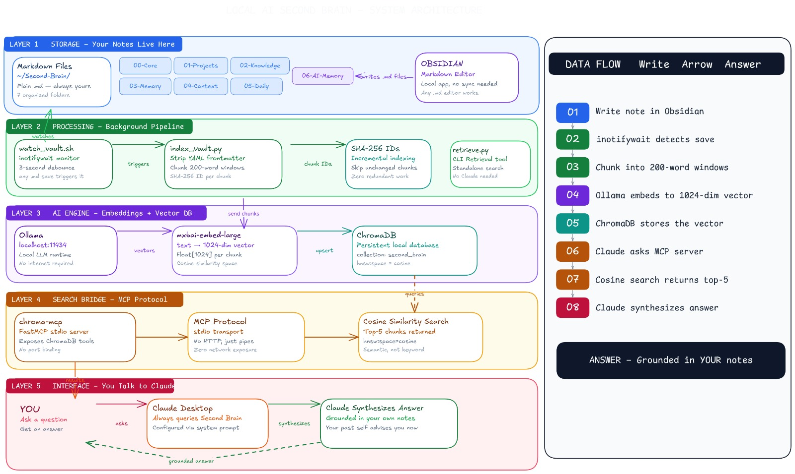
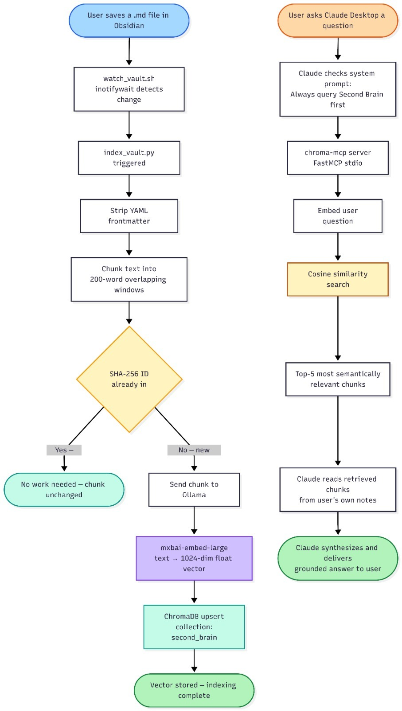

# Local Second Brain

I needed a way to query my own markdown notes from Claude Desktop without sending my personal data to a cloud vector database. This is a local-first semantic retrieval system that chunks, embeds, and indexes my Obsidian vault entirely on my machine, exposing it to Claude via the Model Context Protocol (MCP).

## How it works

The system is a background pipeline that watches a local directory of markdown files. When I save a note, it strips the frontmatter, chunks the text, and calculates a stable SHA-256 hash to skip unchanged content. New chunks are passed to a local Ollama instance for embedding and stored in a persistent ChromaDB index. Claude Desktop connects to this index over an MCP stdio pipe, intercepting queries before they hit the foundation model. If a semantic match is found, Claude synthesizes an answer and cites the specific chunk and similarity score.

## Vault structure

I organize my raw markdown into seven numbered directories. This isn't just for neatness; it dictates how knowledge moves from temporary scratchpad to permanent memory.

- `00-Core/`: System configs, frontmatter templates, and Claude's system prompt.
- `01-Projects/`: Active, scoped work.
- `02-Knowledge/`: Permanent reference material. Facts, documentation, and architectural decisions.
- `03-Memory/`: Episodic memory. Setup instructions, error logs, and things I refuse to figure out twice.
- `04-Context/`: My active working set. Whatever holds my immediate focus.
- `05-Daily/`: Daily logs, meeting notes, and transient thoughts.
- `06-AI-Memory/`: Distilled insights formatted explicitly for the LLM. After a complex debugging session, I prompt Claude to compress the solution and drop it here for future retrieval.

The workflow is straightforward. I write fast in `05-Daily` and promote durable facts to `02-Knowledge`. I let the pipeline handle the embeddings, relying on semantic search rather than strict folder hierarchies to surface related ideas.

## Architecture

The system is composed of five layers running locally on my machine. Here is the component layout and data flow.



Storage is handled by raw markdown files, processed by a local script, embedded by Ollama, stored in ChromaDB, and finally bridged to Claude Desktop via MCP.

The data moves through two distinct paths depending on whether I am writing a note or asking a question.



The write path is event-driven via filesystem hooks, while the read path is triggered on-demand by Claude's tool-calling capabilities.

## The Pipeline

The ingestion script (`index_vault.py`) uses 200-word windows with a 20-word overlap. I use `mxbai-embed-large` via Ollama, which yields 1024-dimensional vectors. These are upserted into ChromaDB 1.5.9, backed by SQLite and an HNSW index using cosine similarity. Auto-indexing is handled by `watch_vault.sh`, which wraps `inotifywait` with a 3-second debounce to avoid hammering the embedding model when I hit save multiple times.

The bridge to Claude is `chroma-mcp 0.2.6`. It runs as a FastMCP server over a stdio transport. There are no exposed ports and no HTTP overhead; Claude manages the subprocess directly. I enforce a strict retrieval-first protocol via Claude's system prompt, requiring it to query the database and cite specific chunk similarity scores before relying on its pre-trained weights.

To make the invisible semantic connections visible, I wrote a graph script. It averages the vectors per file, computes pairwise cosine similarity, and injects Obsidian wikilinks directly into the markdown frontmatter of highly correlated notes.

Right now, the index is tiny: 5 notes, 12 chunks, and a 1.7 MB database. That's intentional. I built the infrastructure first to ensure the retrieval mechanics and MCP boundaries are solid before dumping years of notes into it.

## Setup

Ensure Ollama is running locally with the embedding model pulled (`ollama pull mxbai-embed-large`). 

```bash
# Install dependencies
pip install chromadb ollama chroma-mcp

# Build the initial index
python3 scripts/index_vault.py

# Start the background watcher
bash scripts/watch_vault.sh
```

Configure Claude Desktop (`claude_desktop_config.json`) to spawn the MCP server:

```json
{
  "mcpServers": {
    "second-brain-chroma": {
      "command": "chroma-mcp",
      "args": [
        "--client-type", "persistent",
        "--data-dir", "/path/to/.indexes/chroma"
      ]
    }
  }
}
```

## What's next

The current chunking strategy is naive. Splitting purely on word count occasionally breaks semantic boundaries if a paragraph spans across chunks. I plan to move to AST-based markdown parsing to chunk at header and paragraph boundaries. I also need to write a script to garbage collect orphaned chunks when a file is deleted, as the current implementation only handles upserts.
